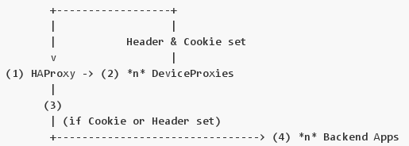

Device Detection for the Web
============================

Introduction
++++++++++++

Low-end mobile handsets often do not have the capabilities to report
the available hardware specifications contained in the device. Their web
browsers do however report fairly unique user-agent strings that allow
devices to be identified. We don't maintain a database of these user-agent
strings and device information, but instead rely on 3rd party APIs for
this.

Working
+++++++

Haproxy is a load-balancing proxy that receives incoming traffic from
the web server software, Nginx.

The request is then passed to Device Proxy, where HTTP headers are then
inserted (possibly from cached WURFL or OpenDDR lookups). WURFL is a 3rd
party API that contains a database of user-agent IDs and the associated
hardware for the device.

Device Proxy has the option of inserting Cookies into the HTTP response
which can cache the Device Lookup (for subsequent requests HAProxy (1)
could use these cookie values to skip DeviceProxy completely for the lifetime
of the Cookie.) DeviceProxy reverse proxies back to HAProxy with HTTP headers
inserted.

HAProxy inspects the HTTP headers & cookies received and selects appropriate
backend application for the request. HAProxy can have a default fallback
backend. If the Cookie is already set then the DeviceProxies are skipped.
T
he Backend application renders the request with a template set suitable for
the given HTTP request.

Code
++++

- Device Proxy on Github: https://github.com/praekelt/device-proxy

Example
+++++++

The pages below depict two versions of a site each running on their own
port. Device Proxy will direct to the correct version of the site
depending on the device definitions.

- http://gfm.guinnessvip.com:8002/ -
  provides a responsive web version of the site.

- http://gfm.guinnessvip.com:8003/ -
provides a mobi version of the site.

See Also
++++++++

- Wurfl on Wikipedia: http://en.wikipedia.org/wiki/WURFL
- HAProxy on Wikipedia: http://en.wikipedia.org/wiki/HAProxy
- Nginx on Wikipedia: http://en.wikipedia.org/wiki/Nginx
