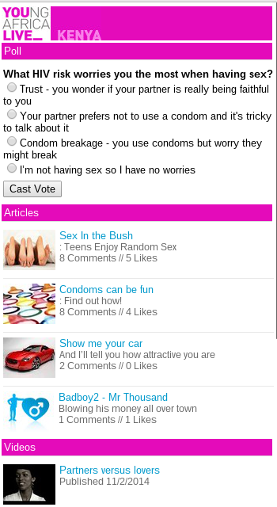

Mobile Website (mobisite)
=========================

Introduction
++++++++++++

Low end and also older high-end phones do not ship with a fully capable web
browser. Instead, they typically ship with very basic browsers that support:

- Text
- Hyperlinks
- Small images
- Colour

These basic browsers typically don't support:

- Javascript
- CSS
- Fonts

Screenshots
+++++++++++

The screenshots below depict some examples of mobi sites. Note the basic
styling. These are rendered on a desktop browser, on mobi devices they
may appear even more basic.

Code
++++

- Use only to the most basic HTML elements when designing sites
  for mobile devices. Anything else may be too loosely defined
  and be subject to being ignored or incorrectly rendered.

Device Detection
++++++++++++++++

Since low-end devices have no (or poor) local scripting abilities, it's
impossible to let the local device decide which version of a site it
should attempt to render. This means that server-side code is implemented
to determine whether a device should get the web version of a site or a
mobi version. External device detection services are typically use, please
refer to the Device Detection pattern doc for more information.

See Also:

- Device Detection Pattern
