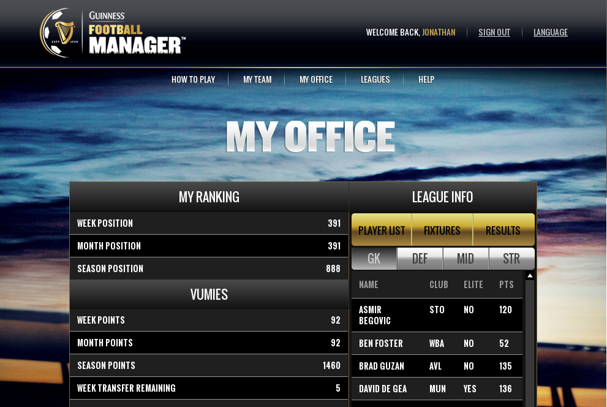
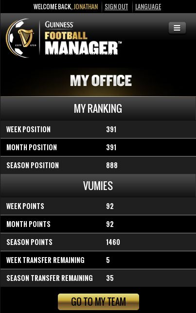
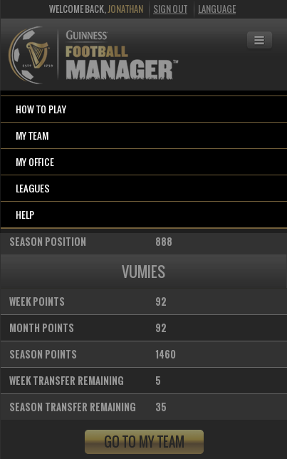

Responsive Web Design
=====================

Introduction
++++++++++++

When web browsers were first introduced on mobile phones, it had very limited rendering functionality. Stylesheet support was poor, if even supported at all. There was also no font support, amongst many other differences compared to desktop web browsers.

On smartphones, this has changed completely. The rendering engines used on smartphones are nearly identical to those found on the desktop web browsers.

The result of this recent development in mobile web browsing means that the biggest differences between a desktop version of a website and a mobile version are:
- Screen size
- Touch-friendlyness on mobile devices

Because of the small amount of differences possible on a mobile and desktop version of a web site, the concept of a responsive site is born.

A responsive utilises java-script that runs on the device that makes minor modifications to the page depending on screen-width.

Typically, if the screen width is found to be less than a certain value of pixels, the menu will be collapsed and be replaced by a menu icon that contains the menu entries. This reduces the amount of space the menus utilize, creating more space for content while also being more touch-friendly.

In some cases, sections of pages and tables are also collapsed to allow for more content. Pressing an icon would typically expand these to their full size.

Screenshots
+++++++++++

The screenshot below depicts how the Guinness Football Manager responsive site renders on when there is enough screen-width available for a full view. This is typically what it would look like on a desktop or tablet computer:

The screenshots below depict what the exact same webpage looks like when the width is reduced. The client-side javascript will automatically apply the required changes. A red arrow is added to The screenshot on the left to indicate the location of the menu button, while the screenshot on the right has been modified to highlight the resulting menu when the button is pressed.

Scoping Considerations
++++++++++++++++++++++

Low-end Devices:

Responsive sites are extremely effective on desktops, tablets and smartphones, but render very poorly (if at all) on low-end devices - especially devices that don't support javascript.

If a project requires support for low-end (feature) phones, then a server-side implementation is required that will provide an entirely differnent page which is more suited for basic devices.

Supporting low-end devices as well as the standard devices listed above requires a significant amount of work. Please refer to the Feature Phone Template pattern for more information.

Code
++++

- Twitter Bootstrap provides an example of responsive code plus many elements:
 - Github: https://github.com/twbs/bootstrap
 - Demo: http://getbootstrap.com/

See Also:
+++++++++

- Examples of responsive sites:
 - KCB Bank Group: http://www.kcbbankgroup.com/
 - Guinness Football Manager: http://gfm.guinnessvip.com/
 - MPowering Health: http://mpoweringhealth.org/
- Related patterns:
 - Feature Phone Template
