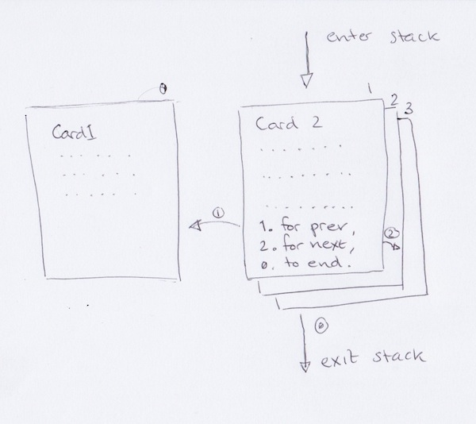

Card Stack
==========

A card stack allows an end-user to read small bits of content in separate
chunks. The content can be dynamically loaded from an external API.

Code
~~~~

The state that implements this pattern is called the `BookletState` and
is documented at the `Go JSBox documentation`_.

Implementations
---------------

- `Girl Hub Rwanda`_ uses a card stack to display content over
  USSD which is loaded from a Django based TastyPie API.
- `Wikipedia Text`_ uses a card stack to allow a user to retrieve chunks
  of a Wikipedia article's content via SMS.

Notes
~~~~~

-   For USSD there is generally a maximum window of 30 seconds within
    which the content needs to be displayed, read and be responded to
    before a timeout is reached.
-   There is no limit on how many pages a Booklet can contain. If this uses
    a session based transport like USSD the limits are all determined by
    the total session length that the mobile network operator imposes.
    In South Africa this is 3 minutes but this varies per country.

.. _`Girl Hub Rwanda`: https://github.com/praekelt/go-nike-ghr/blob/develop/js_sandbox/lib/go-nike-ghr.js#L441-L459
.. _`Go JSBox documentation`: http://vumi-jssandbox-toolkit.readthedocs.org/en/latest/states.html#BookletState
.. _`Wikipedia Text`: https://github.com/praekelt/vumi-wikipedia/
