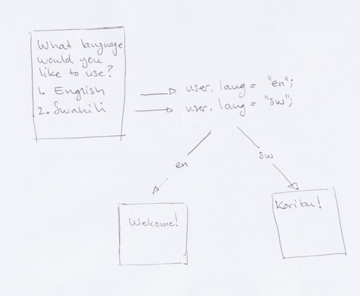

Language Choice
===============

The language choice pattern allows a user to select their language choice
of preference. The language choice is only sticky for the duration of
the session. If language choice preference is to be maintained across
sessions it needs to be stored somewhere more permanent than a temporary
session store.

Code
~~~~

The state that implements the language choice is called the
LanguageChoice_ and is documented at the `Go JSBox documentation`_.

Implementations
~~~~~~~~~~~~~~~

-   Switchboard_ uses the LanguageChoice_ to allow the user to select
    a language of preference for the duration of a USSD session.

Notes
~~~~~

-   Vumi Go's ``i18n`` machinery works in tandem with the
    `InteractionMachine`_'s utilities for `fetching of translations`_
    for the selected language.

.. _`Go JSBox documentation`: http://vumi-jssandbox-toolkit.readthedocs.org/
.. _LanguageChoice: http://vumi-jssandbox-toolkit.readthedocs.org/en/latest/states.html#LanguageChoice
.. _InteractionMachine: http://vumi-jssandbox-toolkit.readthedocs.org/en/latest/interaction_machine.html
.. _`fetching of translations`: http://vumi-jssandbox-toolkit.readthedocs.org/en/latest/interaction_machine.html#InteractionMachine.fetch_translation
.. _Switchboard: https://github.com/praekelt/switchboard-go/blob/master/lib/switchboard-ussd.js#L655-L672